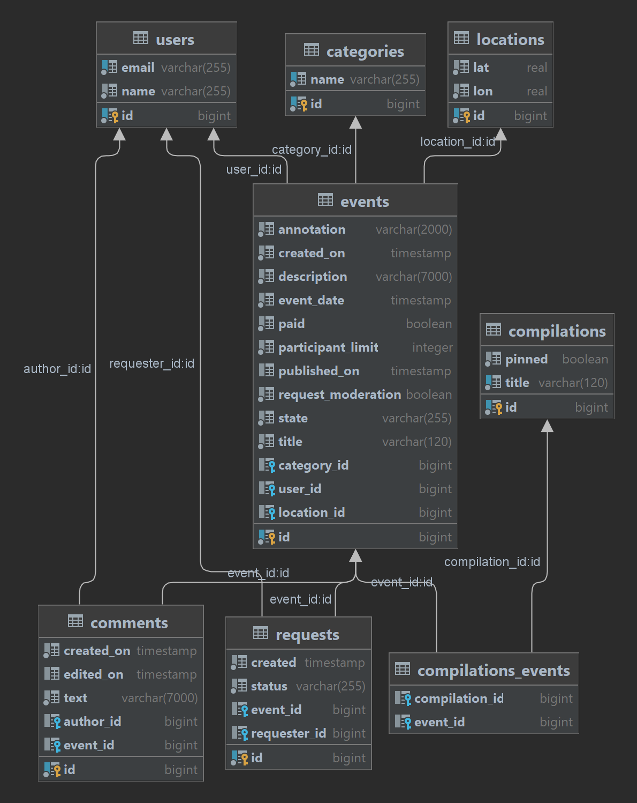

# java-explore-with-me

### Описание
Приложение предоставляет сервис для планирования интересных событий (афиша) и поиска компании для участия в них.

Приложение состоит из четырех микросервисов - основной сервис, основная БД, сервис статистики просмотров, БД для статистики. 
Каждый микросервис поднимается в отдельном docker-контейнере.

[Ссылка на финальный PR](https://github.com/StRaiGT/java-explore-with-me/pull/3)

## Endpoints
- [Техническое задание для API основного сервиса](./ewm-main-service-spec.json)
- [Техническое задание для API сервиса статистики](./ewm-stats-service-spec.json)
- В качестве дополнительной фичи реализован функционал комментариев.

### Comments
- `[GET] /admin/comments?from={from}&size={size}` – получить список всех комментариев с пагинацией
- `[DELETE] /admin/comments/{commentId}` – удалить комментарий `commentId`
- `[POST] /users/{userId}/comments?eventId={eventId}` – создать новый комментарий к событию `eventId` 
пользователем `userId`
- `[PATCH] /users/{userId}/comments/{commentId}` – обновить свой комментарий `commentId` пользователем `userId`
- `[DELETE] /users/{userId}/comments/{commentId}` - удалить свой комментарий `commentId` пользователем `userId`
- `[GET] /users/{userId}/comments?eventId={eventId}&from={from}&size={size}` - получить список всех комментариев 
пользователя `userId` к событию `eventId` с пагинацией
- `[GET] /users/{userId}/comments?from={from}&size={size}` - получить список всех комментариев пользователя `userId` 
с пагинацией
- `[GET] /comments?eventId={eventId}&from={from}&size={size}` – получить список всех комментариев к событию `eventId` 
с пагинацией
- `[GET] /comments/{commentId}` – получить комментарий `commentId`

## Схема базы данных основного сервиса
